# 🤖 Intelligent Time Series Forecasting System

> **Production-ready forecasting powered by AWS Bedrock AgentCore, Code Interpreter, and SageMaker**

[](https://opensource.org/licenses/MIT)
[](https://aws.amazon.com)
[](https://www.python.org)

## 🌟 What This Does

An **intelligent AI agent** that automatically analyzes time series data, engineers features, tunes hyperparameters, trains models, and generates forecast reports — all without manual intervention.

### Key Capabilities

- 🧠 **Auto-analyze** datasets for stationarity, seasonality, and trends
- ⚙️ **Smart feature engineering** with AI-powered recommendations
- 🎯 **Bayesian hyperparameter optimization** via SageMaker
- 🚀 **One-click deployment** to production endpoints
- 📊 **Interactive reports** with Plotly visualizations and confidence intervals

## 🎬 Demo


*Complete 7-step workflow: Upload data → Advanced EDA → Feature recommendations → Feature engineering → Hyperparameter tuning → Model training → Deployment & forecast report generation*

## 🏗️ System Architecture

```mermaid
graph TB
    subgraph User["👤 User Interface"]
        Dashboard["🎨 Streamlit Dashboard<br/>7-Step Workflow"]
        CLI["💻 CLI / API<br/>Direct Agent Calls"]
    end

    subgraph AgentCore["🤖 AWS Bedrock AgentCore<br/>(Orchestration Layer)"]
        Agent["Intelligent Agent<br/>16 Tools"]
        Tools["Tool Router"]
    end

    subgraph CodeInterpreter["🔬 Code Interpreter<br/>(Data Science Layer)"]
        EDA["Statistical Analysis<br/>• Stationarity Tests<br/>• Decomposition<br/>• ACF/PACF"]
        Features["Feature Engineering<br/>• Lag Features<br/>• Rolling Stats<br/>• Calendar Features"]
        Viz["Visualizations<br/>• Plotly Charts<br/>• HTML Reports"]
    end

    subgraph SageMaker["🚀 AWS SageMaker<br/>(ML Production Layer)"]
        Tuning["Hyperparameter<br/>Tuning"]
        Training["Model Training<br/>ARIMA / LSTM"]
        Endpoint["Production<br/>Endpoint"]
    end

    subgraph Storage["💾 AWS S3<br/>(Data Lake)"]
        Raw["Raw Data"]
        Processed["Featured Data"]
        Models["Model Artifacts"]
        Reports["HTML Reports"]
    end

    Dashboard --> Agent
    CLI --> Agent
    Agent --> Tools

    Tools --> EDA
    Tools --> Features
    Tools --> Viz
    Tools --> Tuning
    Tools --> Training

    EDA --> Raw
    Features --> Processed
    Tuning --> Processed
    Training --> Processed
    Training --> Models
    Endpoint --> Models
    Viz --> Reports

    style AgentCore fill:#ff9900
    style CodeInterpreter fill:#3b48cc
    style SageMaker fill:#146eb4
    style Storage fill:#569a31
```



### Three-Layer Architecture

```mermaid
graph LR
    subgraph Layer1["Layer 1: Code Interpreter"]
        L1A["📊 Statistical Analysis"]
        L1B["⚙️ Feature Engineering"]
        L1C["📈 Visualizations"]
    end

    subgraph Layer2["Layer 2: SageMaker"]
        L2A["🎯 Hyperparameter Tuning"]
        L2B["🎓 Model Training"]
        L2C["🚀 Endpoint Deployment"]
    end

    subgraph Layer3["Layer 3: AgentCore"]
        L3A["🔗 API Orchestration"]
        L3B["📦 Result Parsing"]
        L3C["☁️ S3 Uploads"]
    end

    L3A --> L1A
    L3A --> L2A
    L1B --> L2A
    L2B --> L2C

    style Layer1 fill:#e3f2fd
    style Layer2 fill:#fff3e0
    style Layer3 fill:#f3e5f5
```



## 🚀 Quick Start

### One-Command Setup

```bash
# Clone and setup
git clone https://github.com/yourusername/intelligent-forecasting.git
cd intelligent-forecasting
chmod +x scripts/setup.sh
./scripts/setup.sh
```

The setup script automatically:
1. ✅ Verifies AWS CLI, Terraform, Python, UV
2. ✅ Creates S3 bucket with proper structure
3. ✅ Uploads SageMaker training scripts
4. ✅ Generates synthetic test dataset
5. ✅ Deploys infrastructure via Terraform
6. ✅ Installs Python dependencies
7. ✅ (Optional) Deploys to AgentCore

### Manual Setup

<details>
<summary>Click for step-by-step instructions</summary>

```bash
# 1. Configure AWS
export AWS_REGION=us-east-1
export AWS_ACCOUNT_ID=$(aws sts get-caller-identity --query Account --output text)
export BUCKET_NAME="sagemaker-forecasting-${AWS_REGION}-${AWS_ACCOUNT_ID}"

# 2. Create S3 bucket
aws s3 mb s3://$BUCKET_NAME --region $AWS_REGION

# 3. Upload SageMaker scripts
cd sagemaker_scripts
tar -czf inference_working.tar.gz inference_working.py requirements.txt
aws s3 cp inference_working.tar.gz s3://$BUCKET_NAME/sagemaker/code/
cd ..

# 4. Deploy infrastructure
cd terraform
cat > terraform.tfvars <<EOF
aws_region     = "$AWS_REGION"
aws_account_id = "$AWS_ACCOUNT_ID"
bucket_name    = "$BUCKET_NAME"
EOF
terraform init && terraform apply
cd ..

# 5. Install dependencies
uv sync
```

</details>

## 📊 7-Step Workflow

```mermaid
graph TB
    Start([👤 User Uploads CSV])

    Step1["1️⃣ Advanced EDA<br/>Stationarity, Seasonality, Trends"]
    Step2["2️⃣ Feature Recommendations<br/>AI Suggests Optimal Features"]
    Step3["3️⃣ User Selection<br/>Choose Features to Create"]
    Step4["4️⃣ Feature Engineering<br/>Generate Lag, Rolling, Calendar"]
    Step5["5️⃣ Hyperparameter Tuning<br/>Bayesian Optimization"]
    Step6["6️⃣ Model Training<br/>ARIMA or LSTM"]
    Step7["7️⃣ Deployment & Report<br/>Endpoint + Interactive Report"]

    End([📋 Forecast Ready])

    Start --> Step1
    Step1 --> Step2
    Step2 --> Step3
    Step3 --> Step4
    Step4 --> Step5
    Step5 --> Step6
    Step6 --> Step7
    Step7 --> End

    style Step1 fill:#e3f2fd
    style Step2 fill:#e3f2fd
    style Step4 fill:#e3f2fd
    style Step5 fill:#fff3e0
    style Step6 fill:#fff3e0
    style Step7 fill:#c8e6c9
```



### Run Dashboard

```bash
uv run streamlit run scripts/intelligent_dashboard_v2.py
```

## 🎯 Usage Examples

### Option 1: Interactive Dashboard (Recommended)

```bash
uv run streamlit run scripts/intelligent_dashboard_v2.py
```

Upload CSV → Follow 7 steps → Get forecast report

### Option 2: AgentCore CLI

```bash
# Deploy
uv run agentcore configure --entrypoint agent.py
uv run agentcore launch

# Use
agentcore invoke "Analyze s3://bucket/sales.csv and create forecast"
```

### Option 3: Python API

```python
from agents.advanced_eda_agent import run_advanced_eda
from agents.intelligent_feature_engineering_agent import recommend_features, create_features
from agents.sagemaker_simple import create_sagemaker_training_job

# Analyze dataset
eda = run_advanced_eda("s3://bucket/sales.csv")

# Get recommendations
recs = recommend_features("s3://bucket/sales.csv", eda)

# Create features
featured = create_features("s3://bucket/sales.csv", recs)

# Train model
job = create_sagemaker_training_job("forecast-job", featured, role_arn)
```

## 📁 Project Structure

```
intelligent-forecasting/
├── 🤖 agent.py                      # Main AgentCore application (16 tools)
├── 📦 agents/                       # Individual agent implementations
│   ├── dataset_analysis_agent.py   # Auto-detect dataset structure
│   ├── advanced_eda_agent.py       # Statistical analysis
│   ├── intelligent_feature_engineering_agent.py  # Feature engineering
│   ├── comprehensive_report_agent.py  # Report generation
│   ├── sagemaker_tuning.py         # Hyperparameter tuning
│   ├── sagemaker_simple.py         # ARIMA training/deployment
│   └── sagemaker_lstm.py           # LSTM training
├── 🎨 scripts/                      # Utilities
│   ├── intelligent_dashboard_v2.py # Streamlit dashboard
│   ├── setup.sh                    # One-command setup
│   └── update_endpoint.py          # Endpoint management
├── 🚀 sagemaker_scripts/            # SageMaker containers
│   ├── training_arima.py           # ARIMA training
│   ├── inference_working.py        # Inference handler
│   └── requirements.txt            # Dependencies
├── 🏗️ terraform/                     # Infrastructure as code
│   ├── main.tf                     # AWS resources
│   ├── variables.tf                # Configuration
│   ├── iam.tf                      # IAM roles
│   └── sagemaker.tf                # SageMaker setup
└── 🧪 tests/                        # Test suite
    ├── test_end_to_end.py          # Full pipeline test
    └── test_prompts.sh             # Individual tool tests
```

## 🔑 Key Design Patterns

### Pattern 1: Two-Phase Data Handling


```python
# Phase 1: Generate in Code Interpreter (no AWS credentials)
code = '''
import pandas as pd
html_content = create_plotly_report(df)
print("===HTML_START===")
print(html_content)
print("===HTML_END===")
'''

# Phase 2: Upload from AgentCore (has boto3 credentials)
s3_client.put_object(Bucket=bucket, Key=key, Body=html_content)
```

### Pattern 2: S3 Access in Code Interpreter

```python
# Code Interpreter has AWS CLI pre-configured
code = '''
import subprocess
subprocess.run(['aws', 's3', 'cp', 's3://bucket/data.csv', '/tmp/data.csv'])
df = pd.read_csv('/tmp/data.csv')
'''
```

### Pattern 3: Python Object Passing

```python
# ✅ CORRECT: Use repr() for Python dicts
code = f'''
config = {repr(config_dict)}  # True/False (Python)
'''

# ❌ WRONG: Don't use json.dumps()
code = f'''
config = {json.dumps(config_dict)}  # true/false (JSON)
'''
```

## 🎓 Agent Tool Flow


## 🧪 Testing

```bash
# Quick test (no SageMaker jobs)
python tests/test_individual_tools.py

# Full end-to-end test (30-60 min, creates real jobs)
python tests/test_end_to_end.py

# Test with prompts
./tests/test_prompts.sh
```

## 📊 Performance Metrics

| Operation | Duration | Resource |
|-----------|----------|----------|
| Dataset Analysis | 5-10s | Code Interpreter |
| Advanced EDA | 15-30s | Code Interpreter |
| Feature Engineering | 10-20s | Code Interpreter |
| Hyperparameter Tuning | 30-60 min | SageMaker (ml.m5.xlarge) |
| ARIMA Training | 2-5 min | SageMaker (ml.m5.xlarge) |
| LSTM Training | 5-15 min | SageMaker (ml.p3.2xlarge) |
| Endpoint Deployment | 5-7 min | SageMaker |
| Endpoint Inference | <100ms | SageMaker Endpoint |
| Report Generation | 20-40s | Code Interpreter + Endpoint |

## 🔒 Security Features


- ✅ IAM roles with minimal permissions
- ✅ S3 server-side encryption
- ✅ Presigned URLs (24-hour expiry)
- ✅ No hardcoded credentials (auto-detection via STS)
- ✅ Optional VPC isolation for SageMaker

## 🚨 Troubleshooting

### SageMaker Endpoint 500 Error

```bash
# Ensure requirements.txt is packaged with inference script
cd sagemaker_scripts
tar -czf inference_working.tar.gz inference_working.py requirements.txt
aws s3 cp inference_working.tar.gz s3://$BUCKET_NAME/sagemaker/code/
python scripts/update_endpoint.py
```

### Code Interpreter Session Issues

The system now uses proper session management (start → invoke → stop). No action needed.

### Missing Dependencies

Verify `sagemaker_scripts/requirements.txt`:
```txt
statsmodels==0.14.0
pandas>=1.5.0
numpy>=1.23.0
scipy>=1.9.0
```

## 🤝 Contributing

Contributions welcome! Please:

1. Fork the repository
2. Create feature branch (`git checkout -b feature/amazing`)
3. Commit changes (`git commit -m 'Add amazing feature'`)
4. Push to branch (`git push origin feature/amazing`)
5. Open Pull Request

## 📄 License

MIT License - see [LICENSE](LICENSE) file for details.

## 🙏 Acknowledgments

Built with:
- [AWS Bedrock AgentCore](https://aws.amazon.com/bedrock/) - Agent orchestration
- [AWS SageMaker](https://aws.amazon.com/sagemaker/) - ML training/deployment
- [Statsmodels](https://www.statsmodels.org/) - Time series analysis
- [Plotly](https://plotly.com/) - Interactive visualizations
- [Streamlit](https://streamlit.io/) - Dashboard framework

## 📞 Support

- 📖 **Documentation**: See [CLAUDE.md](CLAUDE.md) for architecture details
- 🐛 **Issues**: [GitHub Issues](https://github.com/yourusername/intelligent-forecasting/issues)
- 💬 **Discussions**: [GitHub Discussions](https://github.com/yourusername/intelligent-forecasting/discussions)

---

**Built with ❤️ using AWS Bedrock AgentCore**
